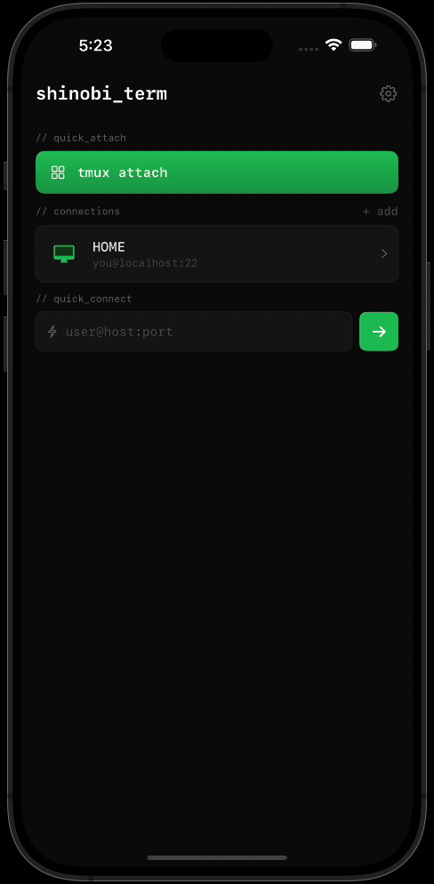

<p align="center">
  
</p>

<h1 align="center">Shinobi Term</h1>

<p align="center">
  <strong>One-tap tmux attach from your iPhone.</strong><br>
  An iOS SSH client built for Claude Code over Tailscale.
</p>

<p align="center">
  <a href="https://github.com/ie3jp/shinobi-term/blob/main/LICENSE">
    
  </a>
  
  
</p>

---

```
iPhone (ShinobiTerm) ── Tailscale / SSH ──→ Mac (tmux → Claude Code)
```

Leave Claude Code running in tmux on your Mac. Pick up where you left off from anywhere — one tap.

<p align="center">
  
</p>

## Features

- **One-tap tmux attach** — Browse sessions sorted by last activity, select, and connect instantly
- **Claude Usage monitor** — Check API usage (session / weekly) via OAuth, displayed as color-coded overlay
- **Read mode** — Scroll, pan, and pinch-zoom terminal output with font size control
- **CJK-first rendering** — Japanese, Chinese, and Korean text displays correctly (Menlo + Hiragino Sans fallback)
- **Extended keyboard** — Ctrl, Alt, Esc, Tab, arrow keys + expandable multi-line input bar
- **SSH key auth** — Generate Ed25519 keys on-device; private keys stored in iOS Keychain
- **Host switching** — Quick-switch between saved connections via dropdown
- **Font size settings** — Adjustable terminal font size, persisted across sessions
- **Free & open source** — MIT License, no ads, no tracking

## Quick Start

### 1. Mac Setup

Enable SSH, install tmux and Claude Code:

```bash
# System Settings → General → Sharing → Remote Login → ON

brew install tmux
npm install -g @anthropic-ai/claude-code
export ANTHROPIC_API_KEY="sk-ant-..."  # also add to ~/.zshrc
```

Start a session:

```bash
tmux new -s dev
claude
```

### 2. Remote Access (Recommended)

Install [Tailscale](https://tailscale.com/) on both Mac and iPhone. Use the Tailscale IP (`100.x.x.x`) as the host in ShinobiTerm.

### 3. Connect from iPhone

1. Open ShinobiTerm → tap **+ add**
2. Enter host, port (`22`), and credentials
3. Tap **tmux attach** → select your session → done

> tmux sessions persist across disconnects — your work is never lost.

## Design

<p align="center">
  
</p>

## Tech Stack

| Component | Library |
|-----------|---------|
| UI | SwiftUI |
| Terminal | [SwiftTerm](https://github.com/migueldeicaza/SwiftTerm) (xterm-256color) |
| SSH | [Citadel](https://github.com/orlandos-nl/Citadel) (Pure Swift / SwiftNIO) |
| SSH Keys | Apple CryptoKit (Ed25519) |
| Data | SwiftData |
| Credentials | iOS Keychain |
| Project | [XcodeGen](https://github.com/yonaskolb/XcodeGen) |

## Build

```bash
brew install xcodegen
cd ShinobiTerm
xcodegen generate
xcodebuild -scheme ShinobiTerm -destination 'platform=iOS Simulator,name=iPhone 16' build
```

## Architecture

```
ShinobiTerm/ShinobiTerm/
├── ShinobiTermApp.swift              # App entry point
├── ContentView.swift                 # Root view
├── Models/
│   ├── ConnectionProfile.swift       # Connection profiles (SwiftData)
│   ├── AppSettings.swift             # App settings
│   └── ClaudeUsage.swift             # Claude API usage metrics
├── Views/
│   ├── ConnectionListView.swift      # Connection list
│   ├── ConnectionFormView.swift      # Add / edit connection
│   ├── TmuxAttachView.swift          # tmux session picker
│   ├── TerminalContainerView.swift   # Terminal + extended keyboard
│   ├── ShinobiTerminalView.swift     # SwiftTerm wrapper
│   ├── ExtraKeysView.swift           # Extended keyboard
│   ├── InputBarView.swift            # Multi-line input bar
│   ├── ScrollOverlayView.swift       # Read mode gesture overlay
│   ├── ClaudeUsageOverlayView.swift  # Claude usage display
│   ├── SSHKeyManagementView.swift    # SSH key management
│   └── SettingsView.swift            # Settings
└── Services/
    ├── SSHSession.swift              # Citadel SSH + PTY
    ├── SSHConnectionManager.swift    # Session lifecycle
    ├── SSHKeyService.swift           # Ed25519 keygen + Keychain
    ├── TmuxService.swift             # tmux ls / attach
    ├── ClaudeUsageService.swift      # Claude API usage via OAuth
    ├── FontManager.swift             # Terminal font management
    ├── TipJarService.swift           # StoreKit 2 Tip Jar
    └── KeychainService.swift         # Keychain read/write
```

## License

MIT License — Copyright (c) 2025 [you tanaka / IE3](https://github.com/rettuce)

---

<details>
<summary>🇯🇵 日本語</summary>

## Shinobi Term

**iPhone から tmux にワンタップで attach する iOS SSH クライアント。**

自宅 Mac の tmux で Claude Code を動かしておけば、外出先から Tailscale 経由でそのまま再開できます。

### 使い方

#### Mac 側

```bash
# システム設定 → 一般 → 共有 → リモートログイン → ON
brew install tmux
npm install -g @anthropic-ai/claude-code
export ANTHROPIC_API_KEY="sk-ant-..."

tmux new -s dev
claude
```

#### リモートアクセス

Mac と iPhone の両方に [Tailscale](https://tailscale.com/) をインストール。Tailscale IP (`100.x.x.x`) を ShinobiTerm の接続先に設定してください。

#### iPhone 側

1. ShinobiTerm を開く → **+ add** をタップ
2. ホスト・ポート (`22`)・認証情報を入力
3. **tmux attach** → セッション選択 → 接続完了

tmux セッションはデタッチしても維持されるため、接続が切れても作業は失われません。

### 主な機能

- **tmux ワンタップ attach** — 最終アクティビティ順のセッション一覧から選んで即接続
- **Claude Usage モニター** — OAuth 経由で API 使用量（セッション / 週間）を確認
- **Read モード** — スクロール・パン・ピンチズームでターミナル出力を閲覧、フォントサイズ調整可能
- **CJK 対応** — 日本語・中国語・韓国語が正しく表示される
- **拡張キーボード** — Ctrl, Alt, Esc, Tab, 矢印キー + 複数行入力バー
- **SSH 鍵認証** — デバイス上で Ed25519 鍵ペアを生成、Keychain に安全に保管
- **ホスト切替** — ドロップダウンで保存済み接続先を素早く切替
- **フォントサイズ設定** — ターミナルのフォントサイズを調整、セッション間で保持
- **無料・OSS** — MIT License、広告なし、トラッキングなし

</details>
