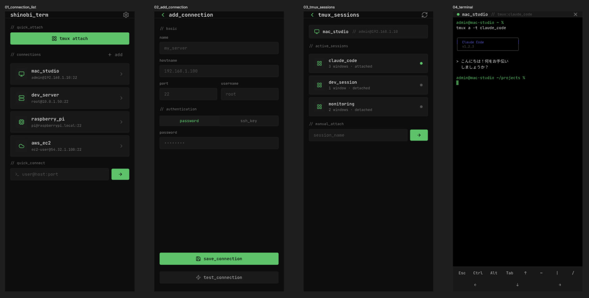

<p align="center">
  
</p>

<h1 align="center">Shinobi Term</h1>

<p align="center">
  CJK 文字を正しく表示する iOS SSH ターミナル<br>
  iPhone/iPad から tmux + Claude Code へ即座にアタッチ
</p>

---

## Overview

**Shinobi Term** は、CJK（日本語・中国語・韓国語）文字の正確なレンダリングに特化した iOS SSH ターミナルクライアントです。

既存の iOS SSH クライアント（Termius, Moshi 等）では CJK 文字が正しく表示されません。Shinobi Term はこの問題を解決し、Apple Silicon Mac 上の tmux セッションで動く Claude Code と自然言語で対話しながら開発を進めるために作られました。

```
┌──────────────┐     SSH      ┌──────────────────────────┐
│  iPhone/iPad │ ──────────── │  Apple Silicon Mac        │
│  Shinobi Term│              │  tmux → Claude Code      │
│              │  tmux attach │  自然言語で開発指示       │
└──────────────┘              └──────────────────────────┘
```

## Features

- **CJK-first** — 日本語・中国語・韓国語が正しく表示される（Menlo + Hiragino Sans フォールバック）
- **tmux 即アタッチ** — セッション一覧から選択、または新規作成してすぐ接続
- **Claude Code companion** — tmux 上の Claude Code と自然言語で開発
- **拡張キーボード** — Ctrl, Alt, Esc, Tab, 矢印キー等のエクストラキー
- **セキュア** — パスワードは iOS Keychain に保存
- **再接続** — 切断後も再アタッチ可能

## Design

<p align="center">
  
</p>

UI デザインは [Pencil](https://pencil.dev/) で作成。Claude Code MCP 連携によりデザインと実装を高速にイテレーション。

## Tech Stack

| Component   | Library                                                                  |
| ----------- | ------------------------------------------------------------------------ |
| UI          | SwiftUI                                                                  |
| Terminal    | [SwiftTerm](https://github.com/migueldeicaza/SwiftTerm) (xterm-256color) |
| SSH         | [Citadel](https://github.com/orlandos-nl/Citadel) (Pure Swift, SwiftNIO) |
| Data        | SwiftData                                                                |
| Credentials | iOS Keychain                                                             |
| Project     | [XcodeGen](https://github.com/yonaskolb/XcodeGen)                        |

## Build

```bash
# Requirements: Xcode 15+, XcodeGen
brew install xcodegen

cd ShinobiTerm
xcodegen generate
xcodebuild -scheme ShinobiTerm -destination 'platform=iOS Simulator,name=iPhone 16' build
```

## Getting Started

Shinobi Term を使うには、接続先の Mac 側でいくつかの準備が必要です。

### 1. SSH サーバーを有効化

macOS で「リモートログイン」を有効にします。

```
システム設定 → 一般 → 共有 → リモートログイン → ON
```

有効化後、ターミナルで接続を確認:

```bash
# Mac の IP アドレスを確認
ipconfig getifaddr en0

# SSH 接続テスト（同じ Mac 上で）
ssh localhost
```

### 2. tmux をインストール

```bash
brew install tmux
```

推奨の `~/.tmux.conf` 設定:

```bash
# マウス操作を有効化（スクロール等）
set -g mouse on

# 256色サポート
set -g default-terminal "xterm-256color"
set -ga terminal-overrides ",xterm-256color:Tc"

# UTF-8
setw -g mode-keys vi
```

### 3. Claude Code をインストール

```bash
npm install -g @anthropic-ai/claude-code
```

API キーを設定:

```bash
export ANTHROPIC_API_KEY="sk-ant-..."
# ~/.zshrc にも追記しておく
```

### 4. tmux セッションを作成して Claude Code を起動

```bash
# 新しい tmux セッションを作成
tmux new -s dev

# セッション内で Claude Code を起動
claude
```

### 5. iPhone から接続

1. Shinobi Term を開く
2. `+ add` で接続プロファイルを作成
   - **Host**: Mac の IP アドレス（例: `192.168.1.10`）
   - **Port**: `22`
   - **Username / Password**: Mac のログインユーザー
3. `tmux attach` ボタンで既存セッションにアタッチ

### ネットワーク要件

- iPhone と Mac が **同じ Wi-Fi** に接続されている必要があります
- 外出先からアクセスするには [Tailscale](https://tailscale.com/) や WireGuard 等の VPN を利用してください

### Tips

- `LANG=en_US.UTF-8` は Shinobi Term が接続時に自動設定します
- tmux セッションはデタッチ後も維持されるため、接続が切れても作業は失われません
- スクロールモードで tmux の出力履歴を閲覧でき、コマンド送信時に自動解除されます

## Architecture

```
ShinobiTerm/ShinobiTerm/
├── Models/
│   └── ConnectionProfile.swift       # 接続プロファイル (SwiftData)
├── Views/
│   ├── ConnectionListView.swift      # 接続一覧
│   ├── ConnectionFormView.swift      # 接続追加・編集
│   ├── TmuxAttachView.swift          # tmux セッション選択・アタッチ
│   ├── TerminalContainerView.swift   # ターミナル + 拡張キーボード
│   ├── ShinobiTerminalView.swift     # SwiftTerm ラッパー
│   ├── ExtraKeysView.swift           # 拡張キーボード
│   └── SettingsView.swift            # 設定・フォント選択
└── Services/
    ├── SSHSession.swift              # Citadel SSH + PTY 管理
    ├── SSHConnectionManager.swift    # セッションライフサイクル
    ├── TmuxService.swift             # tmux ls (executeCommand)
    └── KeychainService.swift         # Keychain 読み書き
```

## License

MIT License — Copyright (c) 2025 you tanaka / IE3

See [LICENSE](LICENSE) for details.
